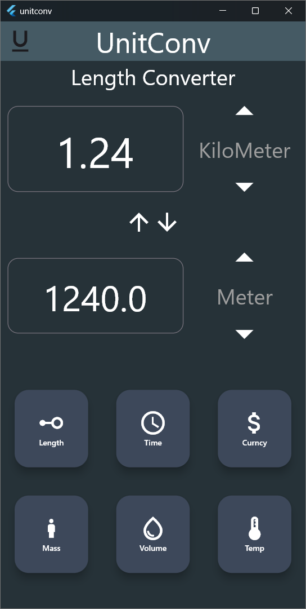
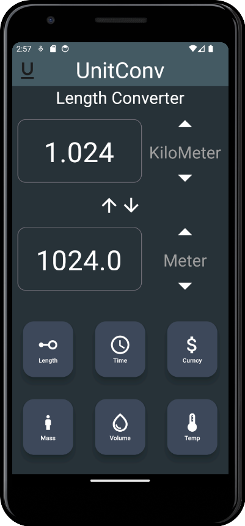

<h1 align="center">-- UnitConv --</h1>

<!-- <div align="center" id="top", > 
  
  
</div> -->
<div style="display: flex; justify-content: center;">
  
  
</div>


## :dart: About ##

A flutter app to convert units with ease and can run on many device.

## :sparkles: Features ##

:heavy_check_mark: can be used to convert units without internet;\
:heavy_check_mark: No ads on the app;\
:heavy_check_mark: minimilistic UI and easy to understand;

## :rocket: Technologies ##

The following tools were used in this project:

- [Flutter](https://expo.io/)
- [Dart](https://nodejs.org/en/)
- [Android development](https://pt-br.reactjs.org/)

## :white_check_mark: Requirements ##

Before starting :checkered_flag:, you need to have [Git](https://git-scm.com) and [flutter](https://nodejs.org/en/) installed on your system.

## :checkered_flag: Starting ##

```bash
# Clone this project
$ git clone https://github.com/{{YOUR_GITHUB_USERNAME}}/flutter

# Access
$ cd flutter

# Install dependencies
$ yarn

# Run the project
$ yarn start

# The server will initialize in the <http://localhost:3000>
```

Made with :heart: by <a href="https://github.com/raj-neelam" target="_blank">Raj Gaurav</a>

&#xa0;
<a href="#top">Back to top</a>
